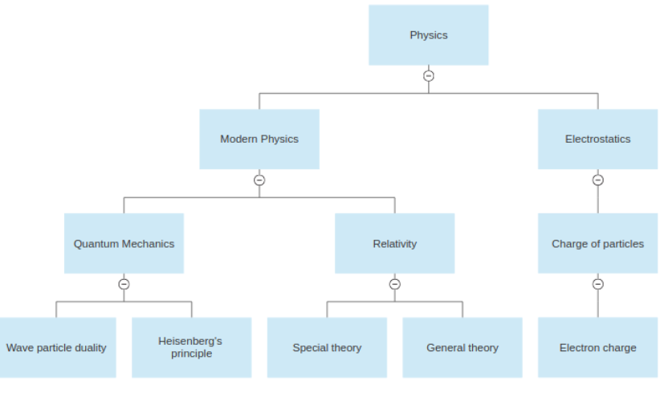
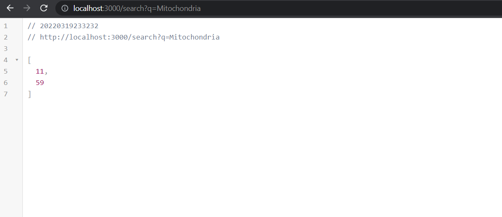

# Questions & Topics

## Project Description

- The objective is to optimize the retrieval of questions that should be retrieved using a query on a certain topic
- Questions can be under a single topic or under multiple topics
- Topics have a tree like structure where a topic like Physics can have children topics like: Modern Physics, Electrostatics, etc.

- There is one endpoint for this application that is called /search?query=`(query)` where query can be any of the topics like Physics, Modern Physics, etc. output of that endpoint is a list of questions' ids that are under that topic subtree


## Project setup

```bash
npm install
```

## Project run

```bash
npm run start
```

## Funcitonal Documentation

```bash
npm run doc
```

then you can find the documentation in a folder created `./docs`

